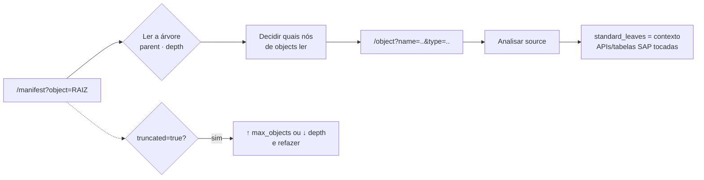

# dAIDEP — Extrator de Dependências ABAP (sem ADT)

> **dAIDEP** (*delaware AI · Dependency Extractor*) é um serviço REST em ABAP puro que expõe, para uma IA, **a árvore de dependências** e **o código-fonte** de qualquer objeto de um sistema **ECC 6.0 sem ADT**. Com isso, a IA consegue fazer toda a extração necessária para planejar uma migração **ECC → S/4HANA**, mesmo em sistemas antigos onde o MCP/ADT não está disponível.
>
> Na família de ferramentas: **`dAIMCPADT`** é o bridge IA ↔ SAP *com* ADT; **`dAIDEP`** é o **par legado**, que abre o mesmo caminho em sistemas *sem* ADT, via REST.

**Repositório:** `dAIDEP` · **Nó SICF / serviço:** `zdepext` · **Confidencial · uso interno delaware**

---

## 1. Por que existe

Nossas ferramentas de IA (dAITECH / dAIATC) falam com o SAP via **ADT**. Em sistemas **ECC 6.0 antigos, o ADT não existe ou não está ativo** — e sem ele a IA fica cega para o código.

Este serviço resolve isso com **duas classes ABAP e um nó SICF**, sem instalar nada no servidor além de objetos Z. Ele entrega dois endpoints HTTP:

- **`/manifest`** — recebe o objeto principal e devolve a **árvore de dependências** (sem código).
- **`/object`** — recebe um objeto e devolve o **código-fonte + metadados**.

A IA lê o manifesto primeiro (mapa mental do programa), decide o que precisa e só então baixa o fonte objeto a objeto.

---

## 2. Arquitetura

```
   IA (Claude)                         SAP ECC 6.0 (sem ADT)
      │                                        │
      │  HTTPS + Basic Auth                    │
      ▼                                        │
  /sap/bc/zdepext  ──►  ZCL_DEP_EXTRACTOR_HTTP  (IF_HTTP_EXTENSION)
                              │  roteia por ~path_info
                              ├─ /manifest ─► handle_manifest
                              └─ /object   ─► handle_object
                                      │
                                      ▼
                          ZCL_DEP_EXTRACTOR  (motor)
                          · normalize_root   (TRAN → PROG/CLAS, autodetecta tipo)
                          · resolve_closure  (BFS de dependências, dedup, limites)
                          · serialize_object (lê o fonte do objeto)
```

Dois objetos, um serviço:

| Objeto | Papel |
|---|---|
| `ZCL_DEP_EXTRACTOR` | Motor: detecta tipo, resolve a árvore de dependências e serializa o fonte. |
| `ZCL_DEP_EXTRACTOR_HTTP` | Handler HTTP (`IF_HTTP_EXTENSION`): roteia `/manifest` e `/object`, monta o JSON e trata erros. |

---

## 3. Instalação

Requer os dois fontes ABAP: `ZCL_DEP_EXTRACTOR.txt` e `ZCL_DEP_EXTRACTOR_HTTP.txt`.

1. **SE24/SE80** → criar a classe `ZCL_DEP_EXTRACTOR`, colar o source, **ativar**.
2. **SE24/SE80** → criar a classe `ZCL_DEP_EXTRACTOR_HTTP`, colar o source, **ativar**.
3. **SICF** → no nó `default_host/sap/bc/` → criar o subnó **`zdepext`**:
   - aba **Handler List**: registrar `ZCL_DEP_EXTRACTOR_HTTP`
   - aba **Logon Data**: procedimento **Standard** (exige **Basic Auth**)
   - **Ativar** (clique direito → *Activate Service*).

Depois disso o serviço responde em:

```
https://<host>:<port>/sap/bc/zdepext
```

---

## 4. Autenticação

**Basic Auth** com **usuário e senha SAP**. O nó SICF usa Logon Data *Standard*, então cada chamada precisa das credenciais do usuário — as permissões de leitura de objeto do próprio usuário SAP valem aqui.

---

## 5. Os dois endpoints

### 5.1 `GET /manifest` — árvore de dependências (sem código)

Resolve o fecho transitivo de dependências a partir de um objeto raiz.

| Parâmetro | Obrigatório | Default | Descrição |
|---|:--:|:--:|---|
| `object` | **sim** | — | Nome do objeto raiz (transação, programa, classe, tabela, FM…). |
| `type` | não | autodetecta | `TRAN` `PROG` `CLAS` `INTF` `FUGR` `FUNC` `TABL` `DTEL` `DOMA`. |
| `depth` | não | `10` | Profundidade máxima da árvore. |
| `max_objects` | não | `500` | Teto de objetos CUSTOMER coletados (proteção contra explosão). |

**Resposta (HTTP 200):**

```json
{
  "root": { "name": "ZADO_REINF_PR001", "type": "PROG" },
  "objects": [
    {
      "name": "ZADO_REINFTB006",
      "type": "TABL",
      "package": "Z_REINF",
      "description": "Eventos REINF",
      "parent": "ZADO_REINF_PR001",
      "depth": 1
    }
  ],
  "standard_leaves": [
    { "name": "CL_SSF_XSF_UTILITIES", "type": "CLAS", "description": "Smart Forms util" }
  ],
  "stats": {
    "objects_count": 12,
    "standard_count": 34,
    "max_depth_reached": 3,
    "truncated": false,
    "runtime_ms": 210
  }
}
```

### 5.2 `GET /object` — código-fonte de UM objeto

| Parâmetro | Obrigatório | Default | Descrição |
|---|:--:|:--:|---|
| `name` | **sim** | — | Nome do objeto. |
| `type` | não | autodetecta | Mesmos tipos do `/manifest`. |

**Resposta (HTTP 200):**

```json
{
  "name": "ZADO_REINFTB006",
  "type": "TABL",
  "package": "Z_REINF",
  "description": "Eventos REINF",
  "source": [
    "linha 1 do objeto",
    "linha 2 do objeto"
  ]
}
```

> `source` é um **array de linhas** (código ABAP, definição de tabela/dtel/domínio, etc.), na ordem original.

### 5.3 Erros

Sempre em JSON, com o texto real do erro — **nunca invente, reporte o `error`**:

| HTTP | Quando | Corpo |
|---|---|---|
| `400` | Parâmetro faltando ou objeto inexistente (`mv_error`). | `{"error":"parametro object obrigatorio"}` |
| `404` | Caminho desconhecido (nem `/manifest` nem `/object`). | `{"error":"recurso desconhecido - use /manifest ou /object"}` |
| `500` | Exceção não tratada (`cx_root`). | `{"error":"<texto da exceção>"}` |

---

## 6. Como o manifesto se lê

- **`root`** — o objeto base já **normalizado**. Ex.: uma `TRAN` vira o `PROG`/`CLAS` por trás dela.
- **`objects`** — dependências **CUSTOMER** (`Z*` / `Y*`). **Só estes têm fonte** disponível via `/object`. Cada nó traz `name`, `type`, `package`, `description`, `parent` (quem o referenciou) e `depth`.
- **`standard_leaves`** — objetos **SAP STANDARD** referenciados. São **só pistas de contexto** (nome + descrição). **Não chame `/object` neles** — não têm fonte e não são o alvo.
- **`stats`** — `objects_count`, `standard_count`, `max_depth_reached`, `truncated`, `runtime_ms`. Se `truncated = true`, **aumente `max_objects` ou reduza `depth`** e refaça.

### Como a classificação funciona (por dentro)

- **Cliente vs. Standard:** nomes iniciados por `Z` ou `Y` são tratados como **customer** (expandem e têm fonte); qualquer outro (inclusive namespaces `/XYZ/`) é tratado como **standard** (vira folha, não expande). *Se seus objetos estão em namespace próprio, a regra precisa ser ajustada em `is_customer`.*
- **Fecho (closure):** busca em largura (BFS) com deduplicação por `(name, type)`; standard vira folha imediatamente, customer é expandido até `depth` ou até bater `max_objects`.

---

## 7. Tipos de objeto suportados

Detecção automática via dicionário (`trdir`, `seoclass`, `tadir`, `dd02l`, `tstc`, `tfdir`, `dd04l`):

| Tipo | O que é | Expande dependências? | Tem fonte? |
|---|---|:--:|:--:|
| `TRAN` | Transação | normaliza para PROG/CLAS | via o objeto raiz |
| `PROG` | Programa / report (+ includes) | sim | sim |
| `CLAS` | Classe | sim | sim |
| `INTF` | Interface | sim | sim |
| `FUGR` | Grupo de funções | sim | sim |
| `FUNC` | Módulo de função | sim | sim |
| `TABL` | Tabela / estrutura | sim (campos → DTEL/DOMA) | sim (definição) |
| `DTEL` | Elemento de dados | sim (→ DOMA) | sim (definição) |
| `DOMA` | Domínio | não (folha) | sim (definição) |

---

## 8. Como a IA usa — prompt

Cole este prompt na ferramenta de IA (dAITECH ou equivalente). Ele descreve as ferramentas, o fluxo obrigatório e as limitações:

```text
Você inspeciona objetos ABAP de um ECC 6.0 (sem ADT) para planejar migração
ECC→S/4HANA. O acesso é por um serviço REST com dois endpoints. Auth: Basic.
Base: https://<host>:<port>/sap/bc/zdepext

FERRAMENTAS
1) GET /manifest?object=<nome>&type=<tipo>&depth=<n>&max_objects=<n>
   Resolve a árvore de dependências de um objeto raiz. NÃO retorna código-fonte.
   - object: obrigatório (transação, programa, classe, tabela, FM…)
   - type:   opcional (TRAN|PROG|CLAS|INTF|FUGR|FUNC|TABL|DTEL|DOMA). Se omitir, autodetecta.
   - depth (default 10), max_objects (default 500): opcionais.
2) GET /object?name=<nome>&type=<tipo>
   Retorna o código-fonte + metadados de UM objeto.

COMO O MANIFESTO SE LÊ
- "root": o objeto base já normalizado (ex.: uma TRAN vira o PROG/CLAS por trás).
- "objects": dependências CUSTOMER (Z*/Y*). SÓ ESTES têm fonte disponível via /object.
  Cada nó traz name, type, package, parent (quem o referenciou) e depth.
- "standard_leaves": objetos SAP STANDARD referenciados. São só pistas de contexto
  (nome + descrição). NÃO chame /object neles — não têm fonte e não é o seu alvo.
- "stats": objects_count, standard_count, max_depth_reached, truncated, runtime_ms.
  Se truncated=true, aumente max_objects ou reduza depth e refaça.

FLUXO OBRIGATÓRIO
1. Chame /manifest no objeto raiz. Monte o mapa mental pela árvore (parent/depth).
2. Decida quais nós de "objects" você precisa ler de fato (não puxe tudo cegamente).
3. Para cada um, chame /object?name=..&type=.. e leia o "source".
4. Use "standard_leaves" só para saber QUE APIs/tabelas SAP o código toca
   (relevante p/ migração: ex. Smart Forms, table maintenance, GUI controls).

REGRAS
- Trabalhe sempre manifesto-primeiro; nunca peça /object sem antes ver o manifesto.
- Um erro vem como HTTP 400 com {"error":"..."} — reporte o texto, não invente.
- Limitações do cross-reference: chamadas DINÂMICAS (CALL FUNCTION lv_x, CREATE
  OBJECT dinâmico, PERFORM dinâmico), BAdIs/enhancements e user-exits NÃO aparecem
  na árvore. Ao analisar o source, sinalize esses pontos como dependências ocultas.

EXEMPLO
/manifest?object=Z_ADO_REINF001&type=TRAN
  → root=ZADO_REINF_PR001 (PROG); objects: ZADO_REINFTB006 (TABL),
    ZADO_REINF_EVENTO (DTEL), ZADO_REINF_DOM_EVENTO (DOMA)…; leaves: SVAL,
    CL_SSF_XSF_UTILITIES (Smart Forms), VIEW_MAINTENANCE_CALL…
Depois, para ler a tabela:
/object?name=ZADO_REINFTB006&type=TABL
```

---

## 9. Fluxo de uso (ponta a ponta)



**Regra de ouro:** sempre **manifesto-primeiro**. Nunca chame `/object` sem antes ver o manifesto.

---

## 10. Limitações (importante para migração)

O cross-reference é **estático**. Não aparecem na árvore:

- Chamadas **dinâmicas**: `CALL FUNCTION lv_nome`, `CREATE OBJECT` dinâmico, `PERFORM` dinâmico.
- **BAdIs / enhancements** e **user-exits**.
- Objetos em **namespace próprio** (`/XYZ/`) — tratados como standard por padrão; ajustar `is_customer` se necessário.

Ao analisar o `source`, a IA deve **sinalizar esses pontos como dependências ocultas** — eles são exatamente os que costumam quebrar em migração e precisam de revisão manual.

---

## 11. Referência técnica (resumo)

**`ZCL_DEP_EXTRACTOR`** (motor)

- Tipos públicos: `ty_root`, `ty_ref`, `ty_node` (`name`, `type`, `package`, `description`, `parent`, `depth`, `is_standard`), `ty_stats`, `ty_serialized` (`…`, `source`).
- `MV_ERROR` (read-only): preenchido quando um método falha; **vazio = sucesso** (checar após `normalize_root` / `serialize_object`).
- `NORMALIZE_ROOT` — autodetecta tipo e normaliza a raiz (TRAN → PROG/CLAS, inclusive transação OO via `TSTCP CLASS=`).
- `RESOLVE_CLOSURE` — BFS de dependências com `depth` / `max_objects`; devolve `et_objects`, `et_leaves`, `es_stats`.
- `SERIALIZE_OBJECT` — devolve `name/type/package/description/source` do objeto.

**`ZCL_DEP_EXTRACTOR_HTTP`** (handler)

- `IF_HTTP_EXTENSION~HANDLE_REQUEST` — roteia por `~path_info` (`/manifest`, `/object`); captura `cx_root` → 500.
- `handle_manifest` / `handle_object` — validam parâmetros, chamam o motor e montam o JSON (com `escape_json` para `\`, `"`, tab, CR/LF).
- `send_json` — `Content-Type: application/json; charset=utf-8` + status.

---

*`dAIDEP` — ferramenta interna delaware · família dAITECH (par legado do `dAIMCPADT`). Não redistribuir.*
